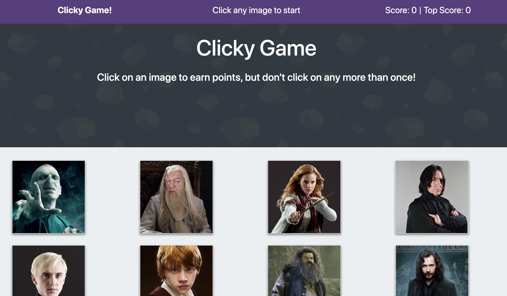

Clicky Game
----------

Licensing Information: READ LICENSE
---
Project source can be downloaded from https://github.com/lordpaulthomas/potter-clicky-game
----
Author
-----------
Paul Thomas


Description of Game
-----------
Clicky Game is a _Harry Potter_ based memory game built with React.js.  
12 images are shown on the screen.  Every time an image is clicked, the 
images locations will get shuffled making it more difficult for the player to win.
Think you can win?

### Rules:
The game rules are very simple:
-------
* Click an image to start
* Click the same image twice, the game is over
* Click all 12 images in a row, win the game

Link to play the game deployed on GitHut Pages:
https://lordpaulthomas.github.io/potter-clicky-game/

To play locally on your computer follow _Clone Instructions_

* Clone Instructions

From your command line interface:
- Navigate to desired download location
- Use the command ```git clone https://github.com/lordpaulthomas/potter-clicky-game.git```
- Then enter the root file with the command ```cd potter-clicky-game```
- Download needed modules for the game ```npm install shuffle-array reactstrap```
- Start the game with the command ```npm start``
- Open your default browser and go to address *http://localhost:3000/*
- To exit the game press  ```[control] + C```  from the command line interface


# Screen Shot of Game



